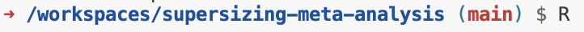

#  Features and Findings of the "Metapsy" Meta-Analytic Research Domain: Reproducible Code Repository

- This repository contains the data and analysis code for the manuscript "Features and Findings of the Metapsy Meta-Analytic
Research Domain for Psychological Treatments".
- All datasets used to generate the analyses and plots can be found in the `data` folder.
- The results of all analyses are saved in the `results` folder.
- The main file used to conducted the meta-analyses is `02-meta-analysis.R` at the base of the repository.

 

## 🕹 Open As a Virtual Environment

This repository contains a [`renv`](https://rstudio.github.io/renv/index.html) lockfile and Docker container. This can be
used to open the repository as a fully reproducible virtual environment, running with R version 4.1.2 on a Linux image.

### Open Github Codespace

The virtual environment can be initialized with [Github Codespaces](https://github.com/features/codespaces). Please note that this requires you to be **logged in** with your personal **Github account**. 

Click on the **Code** button; in the dropdown, open **Codespaces**. Then, click on the button **Create codespace on master**. This starts the setup of your virtual environment. Please note that the setup takes up to about 5 minutes.

### Restore the R environment

1. Once the code editor has been opened, go to the **Console** on the bottom. Type in `R`, and then hit enter.
This opens an R session in your environment.

 

2. Next, restore the R environment by running `renv::restore()` in the Console. Please note that this takes about 10-15 minutes to complete!

 

3. During the restoration process, R may ask you if you want to **proceed**. By default, answer with "yes" by typing in `y`, and then hit Enter:

 

4. Once the setup is complete, navigate to the **"Extensions" pane**  in the left sidebar. There, search for and install ["REditorSupport"](https://marketplace.visualstudio.com/items?itemName=REditorSupport.r). 

